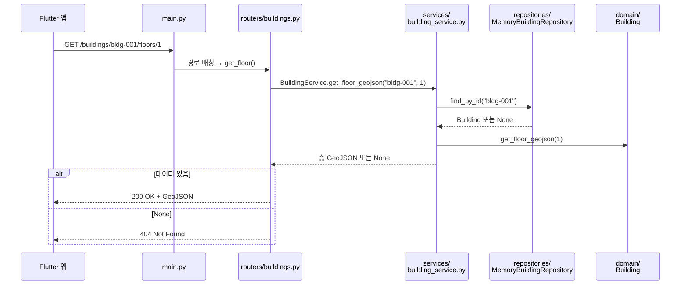
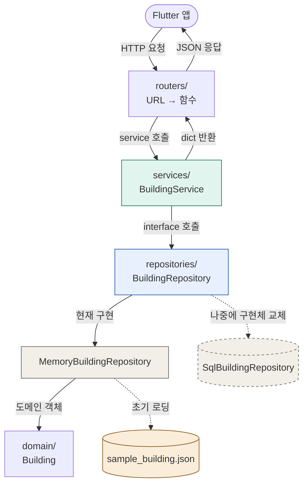

# M1-002 · FastAPI 백엔드 골격 생성

- **상태**: Done
- **마일스톤**: M1 · 프로젝트 초기 설정
- **컴포넌트**: api
- **GitHub**: #7
- **선행 이슈**: 없음 (M1-001과 병렬 가능)

## 한눈에

평면도 GeoJSON을 서빙하고, 이후 RAG 엔드포인트가 붙을 **최소 FastAPI 골격**을 만든다.
측위 연산은 클라이언트(온디바이스)가 하므로 백엔드 책임은 **① 정적 데이터 서빙 + ② (이후)RAG** 두 가지로 한정한다.

이미 만들어진 코드를 **그냥 돌려보고 싶다면** 이것만:

```powershell
cd api
python -m venv .venv
.venv\Scripts\activate
pip install -r requirements.txt
uvicorn app.main:app --reload
```

→ http://localhost:8000/docs 가 뜨면 끝. 처음부터 직접 만들어보려면 아래 [따라하기](#따라하기)로.

---

## 따라하기

아래로 내려가며 파일을 하나씩 만든다. 순서는 **의존성 순서**(데이터 → 로직 → 경로 → 진입점)라,
각 단계에서 필요한 게 이미 앞 단계에 존재한다. 각 코드 블록은 그대로 붙여넣어도 동작한다.

만들 최종 구조:

```
api/
├── app/
│   ├── main.py          ← 진입점 (라우터 연결 + 미들웨어)
│   ├── core/            ← FastAPI DI 설정
│   │   └── dependencies.py
│   ├── domain/          ← 순수 도메인 객체
│   │   └── building.py
│   ├── routers/         ← URL → 함수 매핑
│   │   ├── buildings.py
│   │   └── query.py     (스텁)
│   ├── services/        ← 비즈니스 로직
│   │   └── building_service.py
│   ├── repositories/    ← 저장소 인터페이스 + 초기 메모리 구현체
│   │   ├── building_repository.py
│   │   └── memory_building_repository.py
│   ├── schemas/         ← 응답 데이터 구조 (Pydantic, 현재 미연결)
│   │   └── building.py
│   └── data/
│       └── sample_building.json
├── tests/test_main.py
├── requirements.txt
└── README.md
```

> 각 폴더가 "왜" 나뉘어 있는지, 코드가 "왜" 그렇게 생겼는지는 끝의 [더 알아보기](#더-알아보기-참고)에 모아뒀다. 일단은 만드는 데 집중.

### 0단계 — 폴더 만들기 + 가상환경 준비

프로젝트 루트(`Navigation`)에서 시작한다. 먼저 `api/`와 하위 폴더들을 만든다.

```powershell
# 1) api 폴더 생성 후 진입
mkdir api
cd api

# 2) 하위 폴더 한 번에 생성 (중간 폴더는 자동 생성됨)
mkdir app\core, app\domain, app\routers, app\services, app\repositories, app\schemas, app\data, tests

# 3) 빈 __init__.py — 이 폴더들을 "파이썬 패키지"로 인식시켜
#    from app.routers import buildings 같은 import가 동작하게 한다
New-Item app\__init__.py, app\core\__init__.py, app\domain\__init__.py, app\routers\__init__.py, app\services\__init__.py, app\repositories\__init__.py, app\schemas\__init__.py, tests\__init__.py -ItemType File

# 4) 가상환경 생성 + 활성화
python -m venv .venv
.venv\Scripts\activate
```

만들어진 뼈대 확인:

```powershell
tree /F app        # app\, app\core\, app\domain\, app\routers\, app\services\, app\repositories\ 등이 보이면 OK
```

`(.venv)`가 터미널 앞에 붙으면 성공.
(`__init__.py`가 왜 필요한지, venv가 뭔지는 끝의 [더 알아보기](#더-알아보기-참고) 참고.)

### 1단계 — 의존성 — `requirements.txt`

**지금 골격에 실제로 필요한 것만** 버전 핀으로 적는다.

```
fastapi==0.115.*
uvicorn[standard]==0.32.*
pydantic==2.9.*
shapely==2.0.*
pytest
httpx
```

설치:

```powershell
pip install -r requirements.txt
```

- `httpx` — pytest의 `TestClient`가 내부적으로 요구해서 포함.
- `shapely`(공간 연산)는 **이 골격에선 아직 쓰지 않지만**, 곧 이어질 라우팅/공간 쿼리(**M2**)를 대비해 미리 넣어 둔다.

### 2단계 — 샘플 데이터 — `app/data/sample_building.json`

골격 검증용 최소 데이터. 건물 1개, 층 2개(`1`,`2`), 각 층에 복도(`LineString`) + POI(`Point`).
좌표는 실제 GPS(서울 시청 부근)를 쓴다 — GeoJSON 좌표는 **`[경도, 위도]` 순서**임에 주의.

```json
{
  "id": "bldg-001",
  "name": "데모 건물",
  "floors": [1, 2],
  "floor_data": {
    "1": {
      "type": "FeatureCollection",
      "features": [
        { "type": "Feature",
          "properties": { "type": "corridor", "name": "1층 복도" },
          "geometry": { "type": "LineString", "coordinates": [[126.9780, 37.5665], [126.9785, 37.5665]] } },
        { "type": "Feature",
          "properties": { "type": "poi", "name": "강의실 101", "id": "poi-101" },
          "geometry": { "type": "Point", "coordinates": [126.9782, 37.5665] } }
      ]
    },
    "2": {
      "type": "FeatureCollection",
      "features": [
        { "type": "Feature",
          "properties": { "type": "corridor", "name": "2층 복도" },
          "geometry": { "type": "LineString", "coordinates": [[126.9780, 37.5665], [126.9785, 37.5665]] } },
        { "type": "Feature",
          "properties": { "type": "poi", "name": "강의실 201", "id": "poi-201" },
          "geometry": { "type": "Point", "coordinates": [126.9782, 37.5665] } }
      ]
    }
  }
}
```

건물·층을 늘리거나 실제 평면도 좌표로 바꾸는 일은 **M2**에서.

### 3단계 — 도메인 객체 — `app/domain/building.py`

Spring Boot의 `domain` 객체처럼 서비스/저장소 내부에서 사용할 순수 객체를 둔다.
Pydantic 응답 스키마와 분리해두면 나중에 SQL 모델이 생겨도 서비스 로직의 기준이 흔들리지 않는다.

```python
from copy import deepcopy
from dataclasses import dataclass
from typing import Any

@dataclass(frozen=True)
class Building:
    id: str
    name: str
    floors: list[int]
    floor_data: dict[str, dict[str, Any]]

    @classmethod
    def from_dict(cls, data: dict[str, Any]) -> "Building":
        return cls(
            id=data["id"],
            name=data["name"],
            floors=list(data["floors"]),
            floor_data=deepcopy(data["floor_data"]),
        )

    def to_summary(self) -> dict[str, Any]:
        return {"id": self.id, "name": self.name, "floors": list(self.floors)}

    def get_floor_geojson(self, floor: int) -> dict[str, Any] | None:
        geojson = self.floor_data.get(str(floor))
        if geojson is None:
            return None
        return deepcopy(geojson)
```

### 4단계 — Repository 계약 — `app/repositories/building_repository.py`

Python에서는 Spring Boot의 interface 대신 `Protocol`로 저장소 계약을 표현한다.

```python
from typing import Protocol

from app.domain.building import Building

class BuildingRepository(Protocol):
    def find_all(self) -> list[Building]:
        ...

    def find_by_id(self, building_id: str) -> Building | None:
        ...
```

### 5단계 — 초기 메모리 저장소 — `app/repositories/memory_building_repository.py`

초기에는 JSON을 한 번 읽어 `Building` 도메인 객체로 메모리에 보관한다.
나중에 SQL을 선택하면 같은 `BuildingRepository` 계약을 구현하는 `SqlBuildingRepository`만 추가하면 된다.

```python
import json
from pathlib import Path

from app.domain.building import Building

_DEFAULT_DATA_PATH = Path(__file__).parent.parent / "data" / "sample_building.json"

class MemoryBuildingRepository:
    def __init__(
        self,
        buildings: list[Building] | None = None,
        data_path: Path = _DEFAULT_DATA_PATH,
    ):
        if buildings is None:
            buildings = [self._load_building(data_path)]
        self._buildings = {building.id: building for building in buildings}

    def find_all(self) -> list[Building]:
        return list(self._buildings.values())

    def find_by_id(self, building_id: str) -> Building | None:
        return self._buildings.get(building_id)

    def _load_building(self, data_path: Path) -> Building:
        with open(data_path, encoding="utf-8") as f:
            return Building.from_dict(json.load(f))
```

### 6단계 — 비즈니스 로직 — `app/services/building_service.py`

`BuildingService`는 `BuildingRepository` 인터페이스에 의존한다.
라우터가 필요한 응답 형태로 도메인 객체를 가공하는 책임은 여기 둔다.

```python
from typing import Any

from app.repositories.building_repository import BuildingRepository

class BuildingService:
    def __init__(self, building_repository: BuildingRepository):
        self.building_repository = building_repository

    def get_all_buildings(self) -> list[dict[str, Any]]:
        return [building.to_summary() for building in self.building_repository.find_all()]

    def get_building(self, building_id: str) -> dict[str, Any] | None:
        building = self.building_repository.find_by_id(building_id)
        if building is None:
            return None
        return building.to_summary()

    def get_floor_geojson(self, building_id: str, floor: int) -> dict[str, Any] | None:
        building = self.building_repository.find_by_id(building_id)
        if building is None:
            return None
        return building.get_floor_geojson(floor)
```

### 7단계 — DI 설정 — `app/core/dependencies.py`

FastAPI의 `Depends`로 Spring Boot의 생성자 주입과 비슷한 흐름을 만든다.

```python
from functools import lru_cache

from fastapi import Depends

from app.repositories.building_repository import BuildingRepository
from app.repositories.memory_building_repository import MemoryBuildingRepository
from app.services.building_service import BuildingService

@lru_cache
def get_building_repository() -> BuildingRepository:
    return MemoryBuildingRepository()

def get_building_service(
    building_repository: BuildingRepository = Depends(get_building_repository),
) -> BuildingService:
    return BuildingService(building_repository)
```

### 8단계 — 건물 엔드포인트 — `app/routers/buildings.py`

URL을 함수에 연결한다. 라우터는 Controller 역할만 하고, 비즈니스 로직은 `BuildingService`에 위임한다.

```python
from fastapi import APIRouter, Depends, HTTPException

from app.core.dependencies import get_building_service
from app.services.building_service import BuildingService

router = APIRouter(prefix="/buildings", tags=["buildings"])

@router.get("")
def list_buildings(service: BuildingService = Depends(get_building_service)):
    return service.get_all_buildings()

@router.get("/{building_id}")
def get_building(
    building_id: str,
    service: BuildingService = Depends(get_building_service),
):
    result = service.get_building(building_id)
    if result is None:
        raise HTTPException(status_code=404, detail="Building not found")
    return result

@router.get("/{building_id}/floors/{floor}")
def get_floor(
    building_id: str,
    floor: int,
    service: BuildingService = Depends(get_building_service),
):
    result = service.get_floor_geojson(building_id, floor)
    if result is None:
        raise HTTPException(status_code=404, detail="Floor not found")
    return result
```

- `APIRouter(prefix="/buildings")` — 이 파일의 모든 경로 앞에 `/buildings` 자동 삽입.
- 경로의 `{building_id}`가 함수 파라미터로 자동 바인딩 (`/buildings/bldg-001` → `building_id="bldg-001"`).
- 데이터 처리는 service에 위임. `None`이면 404로 변환.

### 9단계 — 응답 스키마 — `app/schemas/building.py`

응답 데이터의 "모양"을 Pydantic으로 정의해 둔다. **지금은 정의만 하고 라우터엔 연결하지 않는다**
— 라우터는 여전히 dict를 그대로 반환한다. 응답 형식을 고정·검증해야 할 때 각 엔드포인트에
`response_model=...`로 이어 붙이면 된다.

```python
from pydantic import BaseModel
from typing import Any

class POI(BaseModel):           # 관심 지점 (강의실·화장실 등)
    id: str
    name: str
    type: str
    geometry: dict[str, Any]              # GeoJSON geometry (Point 등)
    properties: dict[str, Any] = {}       # 추가 속성 (기본값: 빈 dict)

class Floor(BaseModel):         # 층 = 층 번호 + GeoJSON 평면도
    floor: int
    geojson: dict[str, Any]

class Building(BaseModel):      # 건물 기본 정보 (목록·상세 응답용)
    id: str
    name: str
    floors: list[int]
```

> 왜 지금 연결하지 않나: dict를 그대로 돌려줘도 서버는 동작하고, `response_model`을 붙이면
> 응답이 모델과 어긋날 때 에러가 난다. 형식을 "고정"할 준비가 됐을 때 붙이는 게 안전하다.
> 즉 이 파일은 **다음 단계를 위한 밑그림**이다. (`query.py`의 요청 모델과 달리 아직 사용처가 없다.)

### 10단계 — 쿼리 스텁 — `app/routers/query.py`

RAG가 붙을 자리. 지금은 **받은 걸 그대로 돌려주는 스텁**만.

```python
from fastapi import APIRouter
from pydantic import BaseModel

router = APIRouter(prefix="/query", tags=["query"])

class DestinationRequest(BaseModel):   # 받을 JSON 모양 선언 → 자동 파싱·검증
    text: str
    building_id: str

class InfoRequest(BaseModel):
    text: str
    building_id: str

@router.post("/destination")
def query_destination(body: DestinationRequest):
    return {"status": "stub", "query": body.text, "result": None}

@router.post("/info")
def query_info(body: InfoRequest):
    return {"status": "stub", "query": body.text, "result": None}
```

- Body에 필드가 빠지거나 타입이 틀리면 FastAPI가 **자동으로 422** 반환.
- 이 핸들러를 처음부터 손으로 써보며 흐름을 익히고 싶으면 → [부록: 쿼리 핸들러 직접 써보기](#부록--쿼리-핸들러-직접-써보기).

### 11단계 — 진입점 — `app/main.py`

라우터들을 하나의 앱에 모은다.

```python
from fastapi import FastAPI
from fastapi.middleware.cors import CORSMiddleware
from app.routers import buildings, query

app = FastAPI(title="Navigation API", version="0.1.0")

app.add_middleware(                       # 다른 출처(Flutter 앱)의 요청 허용
    CORSMiddleware,
    allow_origins=["*"],                  # 개발용 전체 허용. 배포 시 앱 주소로 교체
    allow_methods=["*"],
    allow_headers=["*"],
)

app.include_router(buildings.router)      # routers/ 파일의 모든 경로를 한 줄로 등록
app.include_router(query.router)

@app.get("/health")                       # 배포·헬스체크용
def health():
    return {"status": "ok"}
```

### 12단계 — 서버 실행

```powershell
uvicorn app.main:app --reload
```

`Uvicorn running on http://127.0.0.1:8000` 이 나오면 성공. (`--reload` = 코드 저장 시 자동 재시작, 개발용.)

브라우저로 확인:

- http://localhost:8000/health → `{"status": "ok"}`
- http://localhost:8000/buildings → 건물 목록
- http://localhost:8000/docs → Swagger UI (전체 엔드포인트, 여기서 바로 테스트 가능)

### 13단계 — 테스트 — `tests/test_main.py`

M1-002의 테스트 코드는 모든 테스트 함수에서 **Given / When / Then** 흐름을 드러내도록 작성한다.
각 테스트는 pytest의 함수 스코프 fixture로 `BeforeEach`/`AfterEach` 초기화를 거친다.

- `BeforeEach` — 테스트마다 앱 override 상태를 비우고 테스트용 `MemoryBuildingRepository`와 새 `TestClient`를 준비한다.
- `# Given` — 테스트에 사용할 입력값, 기대값, 경로를 준비한다.
- `# When` — `TestClient`로 실제 API를 호출한다.
- `# Then` — HTTP 상태 코드와 응답 본문을 검증한다.
- `AfterEach` — 테스트 종료 후 앱 override 상태와 repository cache를 다시 비운다.

```python
import pytest
from fastapi.testclient import TestClient

from app.core.dependencies import get_building_repository
from app.domain.building import Building
from app.main import app
from app.repositories.memory_building_repository import MemoryBuildingRepository

def _test_building() -> Building:
    return Building(
        id="bldg-001",
        name="테스트 건물",
        floors=[1],
        floor_data={
            "1": {
                "type": "FeatureCollection",
                "features": [],
            },
        },
    )

def _create_test_building_repository() -> MemoryBuildingRepository:
    return MemoryBuildingRepository(buildings=[_test_building()])

@pytest.fixture
def api_client():
    # BeforeEach
    app.dependency_overrides.clear()
    get_building_repository.cache_clear()
    app.dependency_overrides[get_building_repository] = _create_test_building_repository
    with TestClient(app) as client:
        yield client

    # AfterEach
    app.dependency_overrides.clear()
    get_building_repository.cache_clear()

def test_health(api_client):
    # Given
    expected_body = {"status": "ok"}

    # When
    response = api_client.get("/health")

    # Then
    assert response.status_code == 200
    assert response.json() == expected_body

def test_list_buildings(api_client):
    # Given
    expected_building_id = "bldg-001"

    # When
    response = api_client.get("/buildings")

    # Then
    assert response.status_code == 200
    assert response.json()[0]["id"] == expected_building_id

def test_get_floor(api_client):
    # Given
    building_id = "bldg-001"
    floor = 1

    # When
    response = api_client.get(f"/buildings/{building_id}/floors/{floor}")

    # Then
    assert response.status_code == 200
    assert response.json()["type"] == "FeatureCollection"

def test_query_destination_stub(api_client):
    # Given
    payload = {"text": "101호 어디야?", "building_id": "bldg-001"}

    # When
    response = api_client.post("/query/destination", json=payload)

    # Then
    assert response.status_code == 200
    assert response.json()["status"] == "stub"
```

실행 (서버를 끄지 않아도 됨, 새 터미널이면 venv 활성화 후):

```powershell
pytest
```

전부 통과하면 골격 완성. **마지막으로 `api/README.md`에 실행법·엔드포인트 표를 적어둔다.**

---

## 검증 (수용 기준)

전부 ✅ 면 이슈 완료:

- [ ] `uvicorn app.main:app --reload`로 서버가 뜬다.
- [ ] `GET /health` → `200 OK`, `{"status":"ok"}`
- [ ] `GET /buildings` → 샘플 건물 목록
- [ ] `GET /buildings/{id}/floors/{floor}` → 유효한 GeoJSON
- [ ] `/docs`(Swagger UI)에 모든 엔드포인트가 보인다.
- [ ] `tests/test_main.py` 테스트 함수가 Given / When / Then 구조를 따른다.
- [ ] `tests/test_main.py`가 pytest fixture로 각 테스트의 BeforeEach / AfterEach 초기화를 수행한다.
- [ ] `pytest` 통과

빠른 명령 확인:

```powershell
curl http://localhost:8000/health
curl http://localhost:8000/buildings
```

### 작업 종료 / 다음에 재개

```powershell
deactivate                  # 종료

# 재개 시 (venv는 한 번만 만들면 됨)
cd api
.venv\Scripts\activate
uvicorn app.main:app --reload
```

---

## 부록 — 쿼리 핸들러 직접 써보기

`/query/destination`을 처음부터 손으로 써보며 "요청 → 함수 → 응답" 흐름을 익히는 연습. (실제 RAG 로직은 09 후속 이슈.)

**1) 받을 JSON 모양을 먼저 상상한다**

```json
{ "text": "101호 어디야?", "building_id": "bldg-001" }
```

**2) 그 모양을 Pydantic 클래스로 옮긴다** (필드 이름·타입만)

```python
from pydantic import BaseModel

class DestinationRequest(BaseModel):
    text: str          # 사용자가 입력한 질문
    building_id: str   # 어느 건물에 대한 질문인지
```

**3) 그 클래스를 파라미터 타입으로 받는 함수를 만든다** (FastAPI가 JSON→클래스 자동 변환)

```python
@router.post("/destination")
def query_destination(body: DestinationRequest):
    return { "status": "stub", "query": body.text, "result": None }   # 받은 질문을 메아리처럼 반환
```

**4) `/docs`에서 직접 호출해 확인한다**

`POST /query/destination` → **Try it out** → 1)의 JSON 입력 → 실행. 아래가 나오면 성공:

```json
{ "status": "stub", "query": "101호 어디야?", "result": null }
```

`result`가 지금은 `null`이다. **09 후속 이슈**에서 이 자리에 "찾은 목적지 좌표"를 채운다.
즉 지금 할 일은 **입출력 통로만 뚫어두는 것**.

---

## 더 알아보기 (참고)

따라하기엔 필요 없지만 "왜 이렇게 나눴나"가 궁금할 때.

### 요청 → 응답이 흐르는 길

요청은 위에서 아래로 계층을 타고 내려가 데이터에 닿고, 응답은 같은 길을 거꾸로 올라온다.
(아래 다이어그램은 GitHub에서 그림으로 렌더된다.)



| 역할 | 폴더 | 이걸 바꾸는 경우 |
|------|------|------------------|
| URL 라우팅 | `routers/` | API 경로를 추가·변경할 때 |
| 비즈니스 로직 | `services/` | 응답 가공·검증 규칙을 바꿀 때 |
| 저장소 계약/구현 | `repositories/` | 데이터 소스를 Memory→SQL로 교체할 때 |
| 도메인 객체 | `domain/` | 내부 데이터 표현을 바꿀 때 |

한 파일이 한 가지 역할만 담당 → 수정 범위가 좁고 다른 부분에 영향이 없다.

### 데이터를 어떻게 관리하나 (교체 지점)

핵심은 service가 데이터 소스 구현체를 직접 알지 않고 **`BuildingRepository` 계약에만 의존**한다는 점.
지금은 `MemoryBuildingRepository`가 JSON을 읽어 메모리에 보관하지만, 나중에 DB로 바꿔도
라우터와 서비스의 공개 동작은 유지한다 — `BuildingRepository`를 구현하는 저장소와 DI 설정만 교체하면 된다.



> `repositories/`가 데이터 소스 교체 지점이다. "JSON으로 시작했다가 나중에 DB로 확장"할 때 라우터와 서비스의 핵심 흐름을 유지할 수 있다.

### 가상환경(venv)은 왜 쓰나

`.venv` 폴더 안에 **이 프로젝트 전용** Python 패키지가 설치된다.
프로젝트마다 필요한 패키지 버전이 달라서, 전역 Python에 깔면 다른 프로젝트와 충돌이 난다.

### `__init__.py`는 왜 필요한가

폴더(`app/`, `routers/` 등)를 **파이썬 패키지**로 인식시키는 표식 파일. 내용은 비어 있어도 된다.
이게 있어야 `from app.routers import buildings` 같은 `import`가 동작한다. 없으면 "모듈을 못 찾는다"는 에러가 난다.

### 코드에서 헷갈리기 쉬운 부분

- `app.add_middleware(CORSMiddleware, allow_origins=["*"], ...)` — Flutter 앱은 서버와 **다른 출처**라 브라우저 보안정책상 기본 차단됨. CORS가 이를 허용. 개발엔 `*`, 배포 시 앱 주소로 교체.
- `_DEFAULT_DATA_PATH = Path(__file__).parent.parent / "data" / "sample_building.json"` — 실행 위치와 무관하게 샘플 데이터를 찾는다.
- `BuildingRepository(Protocol)` — Python에서 interface처럼 저장소 메서드 계약을 표현한다.
- `MemoryBuildingRepository` — 초기 구현체. JSON을 읽은 뒤 메모리의 `Building` 객체를 조회한다.
- `str(floor)` — `floor`는 정수(`1`)지만 JSON 키는 문자열(`"1"`)이라 도메인 객체 내부에서 변환한다.

---

## 이 이슈 범위 밖 (후속 이슈로 분리)

골격 단계엔 불필요해 **의도적으로 제외**한 항목. 실제로 필요해지는 시점의 이슈에서 추가한다.

| 항목 | 이유 | 진행 시점 |
|------|------|-----------|
| `Dockerfile` | 로컬 개발만으로 충분 | 컨테이너 배포 준비 시점 |
| RAG 실제 구현 (sentence-transformers/FAISS) | 골격을 무겁게 만듦. 현재 `/query/*`는 스텁 | **09 문서 후속 이슈** |

> **현재 "정의만 됐고 아직 안 쓰는" 것들** (코드엔 있으나 미연결):
> - `app/schemas/building.py`(`Building`/`Floor`/`POI`) — 응답 모델. 라우터가 dict를 반환 중이라 아직 `response_model=`로 연결 안 됨. 응답 형식을 고정할 때 연결.
> - `shapely` 의존성 — 설치는 돼 있으나 코드에서 아직 호출 안 함. 공간 연산이 필요한 **M2**부터 사용.
>
> 반면 `query.py`의 `DestinationRequest`/`InfoRequest`는 요청 Body 검증에 **실제로 쓰인다**.

## 파일 (Files)

```
api/requirements.txt
api/app/main.py
api/app/core/dependencies.py
api/app/domain/building.py
api/app/routers/buildings.py
api/app/routers/query.py          (스텁)
api/app/services/building_service.py
api/app/repositories/building_repository.py
api/app/repositories/memory_building_repository.py
api/app/schemas/building.py       (정의만, 라우터 미연결)
api/app/data/sample_building.json
api/tests/test_main.py
api/README.md
```

## 메모

- RAG 엔드포인트는 **스텁만** 둔다. sentence-transformers/FAISS 설치는 09 후속 이슈로 분리해 골격이 무거워지지 않게 한다.
- 1차 저장소 구현체는 `MemoryBuildingRepository`다. 샘플 JSON을 메모리 도메인 객체로 올려 운영한다.
- DB는 확장 시점에 `BuildingRepository`를 구현하는 `SqlBuildingRepository`로 추가한다(06 문서).
- 참고: [06-tech-stack.md](../../docs/research/06-tech-stack.md) · [09-rag-integration.md](../../docs/research/09-rag-integration.md)
